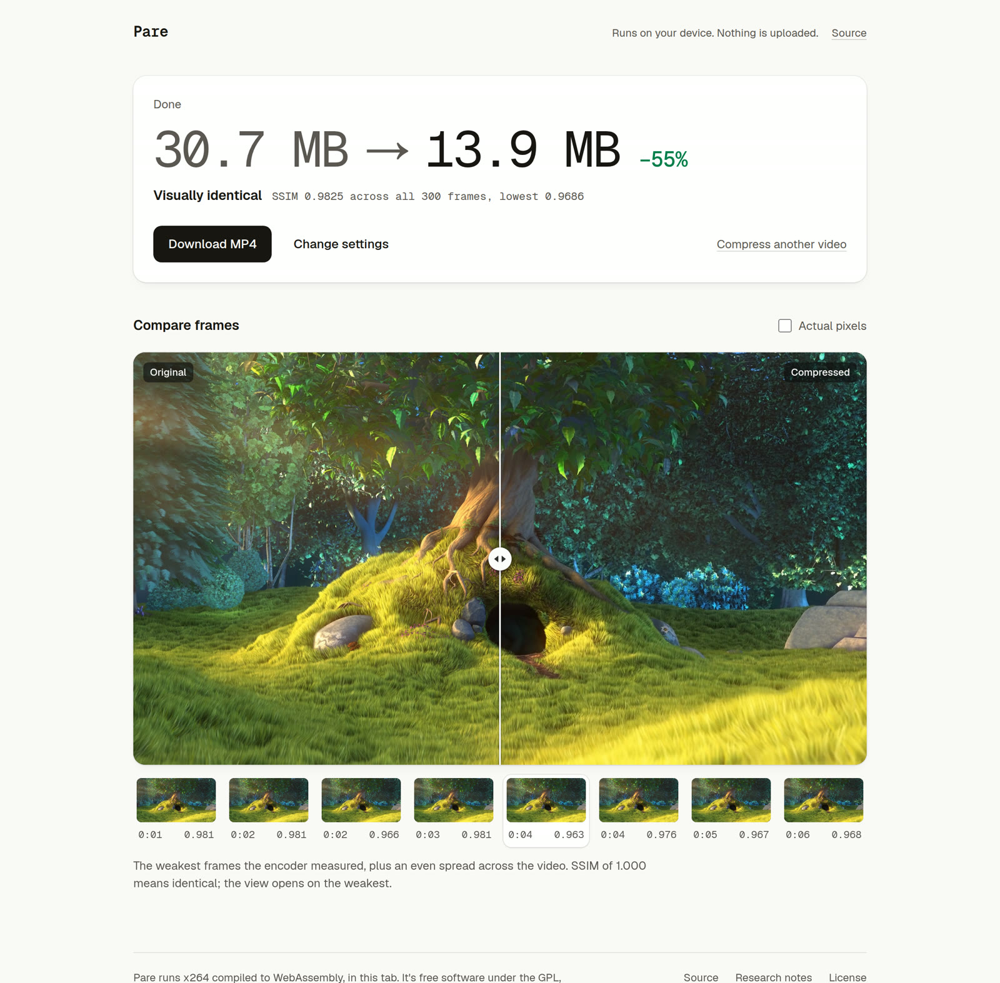

# Pare

Pare makes a video at least half its size and keeps it looking like the original. It runs in the browser tab, so the
file never leaves your computer and there's nothing to install.

**Try it:** https://pare-eight.vercel.app



## Why it's different

Most in-browser video compressors run ffmpeg.wasm. That's x264 with its assembly stripped out, on one thread, and it
works, slowly. Pare started there too, and it took 105 seconds to compress a 20-second phone clip. On a 10-second
clip at the same quality, stock ffmpeg.wasm takes 159 s on one thread and 42 s multithreaded. Pare takes 25 s,
including the test encodes that find the setting for half the size. Native x264 on the same machine takes 6 s. Pare
is within a factor of four of that; one-thread ffmpeg.wasm is 25 times slower.

What Pare does instead:

- **WebAssembly SIMD kernels.** x264 is fast because of hand-written x86 and ARM assembly, which a browser can't run.
  Pare adds about 1,500 lines of WebAssembly SIMD128 in its place: SAD and SATD for motion search, sub-pixel
  interpolation, DCT, quantization, deblocking and more. Each kernel passes x264's own `checkasm` against the C code,
  and whole encodes come out byte-identical to the plain C build. Encoding is 2.0–2.3× faster per core, and the
  result runs at 54% of native x264 with the same settings.
- **The browser decodes.** WebCodecs decodes the source, in hardware when there's a GPU, and frames are copied
  straight into x264's input planes. The encoder module is 824 KB; ffmpeg.wasm is 32 MB. Each chunk's decoder starts
  at the source keyframe before the chunk, which can be hundreds of frames early in a file with a keyframe every 250.
  H.264 frames that nothing refers to are skipped on the way, about half of them when the source uses B-frames.
- **Every core busy to the end.** The video is split into chunks of equal cost, counting the frames each decoder has
  to work through before its chunk starts, and each encoder takes one. Busy footage still encodes up to 1.5× slower
  than calm footage. So once every chunk has shown its speed, the ones that will finish last hand their final frames
  to the encoders that will finish first, at the cost of a keyframe each. Each encoder also runs x264's own frame
  threads, from a second build compiled with pthreads. Two threads per encoder make encoding 13% faster on the same
  cores, because the second one keeps x264 working while the first waits for decoded frames.
- **Few keyframes on short videos.** This one surprised me. Every chunk starts with a keyframe, and cutting a
  5-second clip into 8 chunks costs town 42% and tree 25% more bits than one encode at the same quality (park only
  6%). Short videos now get fewer, longer x264 chunks with more threads each, and that turned out faster too: Big Buck
  Bunny encodes sooner and scores 93.1 instead of 92.8, in a smaller file. AV1 can't take more threads, so its chunk
  keyframes are made coarser instead, which saves 1.9–6.1% of the bits.
- **A head start.** Once the size plan and the format are settled, Pare starts compressing while the settings are
  still on screen, and Compress picks it up wherever it got to. Clicked 15 seconds after loading, camera footage was
  ready 0.1 s after the click instead of 16.9 s, because it had finished while the settings were still open.
- **Room to spare goes to speed.** When a high-bitrate source would fit in half its size even at x264's `superfast`
  preset, which does about half the work, Pare tests that first and uses it if its VMAF NEG is still 95 or more.
  Camera footage went from 29.4 s to 10.8 s at the same VMAF NEG (97.8), in a file 69% smaller instead of 81%.
- **A size promise that gets checked.** Short test encodes estimate how size falls as quality drops. Each chunk gets
  its quality setting from what the finished chunks actually cost, and the final file is weighed. If it isn't at
  least 50% smaller, the busiest chunks are encoded again.
- **Every frame is scored.** x264 computes SSIM for each frame against its input as it encodes. The result screen
  reports the average and the worst frame, and opens a side-by-side view on the weakest ones. Those side-by-side
  frames, drawn as a player draws them, are checked against the encoder's scores, so a file that went wrong between
  the source and the encoder (wrong bit depth, colours or orientation) can't pass as identical.
- **AV1, with SIMD.** SVT-AV1 is compiled to WebAssembly with its x86 SIMD kernels translated automatically, the worst
  emulations replaced, and the motion-search kernels rewritten for WebAssembly (`av1-wasm/`). Its output is
  byte-identical to native SVT-AV1. At the same size it scores about a point higher than x264 on ordinary footage and
  3 to 7 points higher on noisy footage, and it encodes about half as fast.
- **HDR stays HDR.** A 10-bit HDR video (HLG or PQ) is encoded as 10-bit AV1 with its colour tags, when the device
  decodes 10-bit AV1. Before, it was rounded to 8 bits: on a 5-second HLG clip the new file is the same size and 3.3 dB
  closer to the source. The bit depth comes from a decoded frame, not the file's tags: an 8-bit HLG video stays 8-bit
  HLG.
- **Auto picks the format by measuring.** Pare compiles Netflix's libvmaf to WebAssembly too (`vmaf-wasm/`). The size
  plan's test encodes are decoded and scored with VMAF NEG in the browser. AV1 is used when it looks at least a point
  better at the target size and the device can play it, or when it's the only way to halve the file. On the test
  corpus that picked the better encoder in 28 of 30 cases; SSIM would have agreed with VMAF in 21. When H.264's first
  test round already shows fine noise or H.264 at the edge of its range, every clip in the benchmark went to AV1
  anyway, so Auto skips AV1's quality test there and only sizes it. Those clips got 5–45% faster.

The encoder settings come from measurement. Every candidate was swept over rate factors on a test corpus and scored
with VMAF, VMAF NEG, SSIM and PSNR. `faster` with a 40-frame lookahead and weighted prediction needs about 30% fewer
bits than `veryfast` for the same VMAF NEG. A second sweep, for speed, found that diamond motion search and no
8×8-and-smaller inter partitions keep that quality per byte (−0.4% BD-rate) for two thirds of the CPU time. The
details, and the ideas that didn't work, are in [research/RESEARCH.md](research/RESEARCH.md). Every benchmark and how
it was run is in [research/BENCHMARKS.md](research/BENCHMARKS.md).

## Numbers

Visually lossless with the 50% target and format Auto, in Chrome on a 4-core, 8-thread cloud machine with no GPU.
Time runs from clicking Compress, a second after the file loads, to the finished file. VMAF NEG is measured afterwards
with native libvmaf over every frame. Around 93 to 95, a re-encode stops looking different from its source.

| Video | Original | Pare | Time | VMAF NEG (worst frame) |
| --- | --- | --- | --- | --- |
| Camera footage, 1080p30, 10 s | 77.9 MB | 23.9 MB (−69%) | 11 s | 97.8 (95.6) |
| Screen recording, 1080p30, 8 s | 10.8 MB | 3.5 MB (−68%) | 9 s | 99.0 (95.6) |
| Big Buck Bunny, 1080p30, 10 s | 30.7 MB | 13.4 MB (−56%) | 24 s | 93.1 (88.9) |
| Phone clips, 1080p50, 20 s | 65.5 MB | 30.2 MB (−54%) | 42 s | 87.9 (71.9) |
| Phone clips, 1080p50, 2 min | 392 MB | 189 MB (−52%) | 3 min 17 s | 88.5 (67.1) |

All twelve benchmark videos, with the previous build's numbers next to them, are in
[research/BENCHMARKS.md](research/BENCHMARKS.md).

Footage that compresses well keeps x264's CRF 15, where extra bits stop being visible, and lands well past half. When
there's room even at the `superfast` preset, the room goes to speed. Noisy footage gets exactly as much quality as
fits in half the size. The phone clips are the hard case. They're built from noisy 25 Mbps re-encodes, and for some
of that footage VMAF NEG 93 would take 84% to 171% of the original size with either encoder, so at half the size
they score "Excellent" rather than "Visually identical". Where AV1 gets closer, Auto uses it. On the individual clips
it took town from 90.3 to 93.9 and noisy from 80.9 to 87.5.

## Settings

- Quality: visually lossless, high, compact, or an exact copy (the original streams in a new container, every frame
  bit-identical).
- Size: at least 50% smaller (the default), or no limit.
- More options: the encoder (Pare's own, or the browser's WebCodecs encoder, which is faster but less efficient), the
  format (Auto, H.264 or AV1, and HEVC with the browser's encoder), resolution, and audio.

## Running it

```sh
bun install
bun dev
```

The x264 module is checked in at `src/lib/x264/`. To rebuild it from source you need an activated
[Emscripten SDK](https://emscripten.org/docs/getting_started/downloads.html):

```sh
x264-wasm/build.sh
```

The script clones x264 at the commit in `x264-wasm/X264_COMMIT`, applies `x264-simd128.patch`, builds it with
`-msimd128`, runs `checkasm` to check every SIMD kernel against the C reference, and links the binding in
`pare_x264.c`.

## Layout

| Path | What's there |
| --- | --- |
| `src/App.tsx` | The whole interface: landing, settings, progress, result |
| `src/lib/x264.ts` | Size plan, Auto's format choice, chunking and cuts, per-chunk budget, refit, joining, audio |
| `src/lib/encode-worker.ts` | One encoder per worker, fed by WebCodecs through Mediabunny; scores test encodes with VMAF |
| `src/lib/media.ts` | Probing, the WebCodecs encoder path, the frame-by-frame quality check |
| `x264-wasm/` | The SIMD patch, the pinned x264 commit, the C binding, and the build script |
| `av1-wasm/` | The SVT-AV1 patch, dispatch-fallback generator, replacement intrinsic header, C binding, build script |
| `vmaf-wasm/` | The libvmaf patch (AVX2 kernels under Emscripten), the scoring binding, and the build script |
| `research/` | Write-up, benchmark and sweep scripts, corpus builder, and every measurement in `results.jsonl` |

## Limits

- The x264 build is 8-bit: HDR sources encoded as H.264 keep their HDR tags but lose two bits, so smooth gradients can
  band. With AV1 they stay 10-bit. Resizing an HDR video makes it SDR. Phone HDR is HEVC, which the test machine can't
  decode, so that path is untested.
- Each 1080p encoder needs about 400 MB, and Pare uses at most 40% of the memory the device reports, so memory caps
  the encoder count. At 4K that's 2 encoders.
- A refit, when the first pass misses the target, encodes the biggest chunks again on every core. It still adds time,
  about 7 s on a 20-second clip.
- Noisy footage that's already tightly compressed can't be halved at about 1:1 by x264 or SVT-AV1. Two of the test
  clips would need 84–204% of their original size for VMAF NEG 93–95. Pare still halves them, picks the encoder that
  looks best, and says "Good" or "Excellent" instead of "Visually identical".
- Noisy footage that goes to AV1 is the slowest case: 29 to 37 s for 5 to 10 s of 1080p on the benchmark machine,
  against 21 to 31 s for H.264 at 3 to 7 points lower quality. Pare's time scales almost linearly with cores.
- The head start uses the CPU while the settings are on screen; changing a setting stops it.
- Threads need a cross-origin isolated page (the site sends COOP and COEP headers). Without them, or if the threaded
  build fails to start, each encoder runs on one thread.
- Audio an MP4 can't carry is converted to AAC or Opus, mixed down to stereo if the browser's encoder needs that. When
  the browser can't decode or encode it at all, the settings say so before Compress and the copy has no audio.
- Needs a browser with WebCodecs and WebAssembly SIMD. Tested in Chrome, and in WebKit 26.6 (Safari's engine) on
  Linux, where it works but plans about three times slower and can't decode AV1. Firefox and Safari on a Mac haven't
  been tried.

## License

Pare is free software under the GNU General Public License, version 2 or later, because x264 is. See
[LICENSE](LICENSE). The x264 changes are in `x264-wasm/x264-simd128.patch`. SVT-AV1 (BSD-3-Clause-Clear) and libvmaf
(BSD-2-Clause-Patent) keep their own licenses; Pare's changes to them are in `av1-wasm/` and `vmaf-wasm/`.

H.264 is covered by patents in some countries. x264's own licensing notes apply to anyone distributing encoders
built from it.
